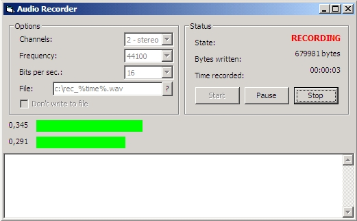

<div align="center">

## Audio Recorder


</div>

### Description

Recording application. Records from current checked inputs in Windows Mixer (recording). User can choice number of channels, sampling frequency, bits per sample. Implemented peak meter (not crappy mixerGetLineControls and so on, normal peak meter). Can be used as a peak meter (option "Do not write to file"). Very minimal chance, program can crash, but I think I've minimalised that danger. Don't forget to VOTE!!!
 
### More Info
 


<span>             |<span>
---                |---
**Submitted On**   |2007-02-04 01:36:46
**By**             |[mnn](https://github.com/Planet-Source-Code/PSCIndex/blob/master/ByAuthor/mnn.md)
**Level**          |Advanced
**User Rating**    |5.0 (30 globes from 6 users)
**Compatibility**  |VB 5\.0, VB 6\.0
**Category**       |[Windows API Call/ Explanation](https://github.com/Planet-Source-Code/PSCIndex/blob/master/ByCategory/windows-api-call-explanation__1-39.md)
**World**          |[Visual Basic](https://github.com/Planet-Source-Code/PSCIndex/blob/master/ByWorld/visual-basic.md)
**Archive File**   |[Audio\_Reco204621242007\.zip](https://github.com/Planet-Source-Code/mnn-audio-recorder__1-67755/archive/master.zip)

### API Declarations

```
Many.
waveIn* for recording
mmioStringToFOURCC for WAVE header
memory functions (like CopyMemory, GlobalAlloc and so on)
subclassing functions (SetWindowLong, CallWindowProc)
```


